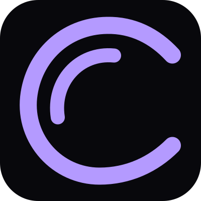
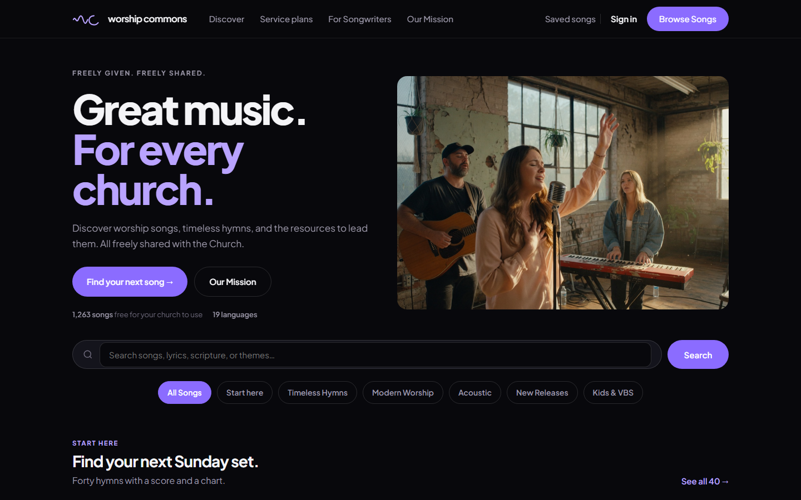
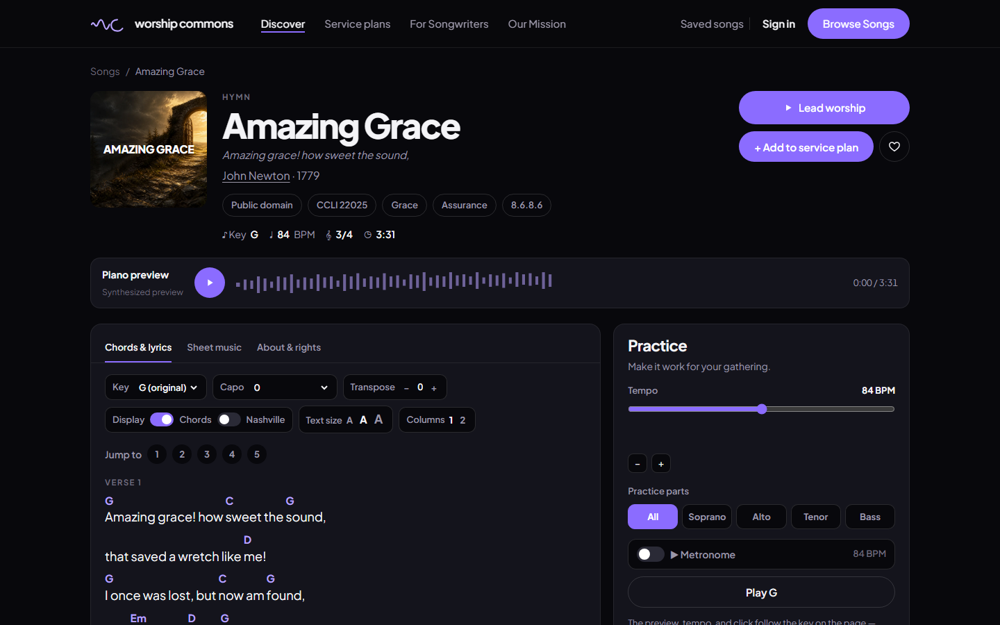

# WorshipCommons

> **WorshipCommons** is a free, open library of worship songs for churches. Public-domain hymns and songs writers chose to share, with chord charts, lyrics, transposition, and slides for Sunday. Visit <a href="https://worshipcommons.org/">https://worshipcommons.org/</a>.

  

  

A service of [ChurchApps](https://churchapps.org).

## Use it

Open [worshipcommons.org](https://worshipcommons.org), find a song, change the key, print the chart, and put the lyrics on a screen. Lead from the browser, or export to FreeShow, OpenLP, or B1 if that is what your church already uses.

What a church may do depends on the song. Public-domain hymns are free for every purpose in the United States (best-effort; other countries may differ). Songs shared under the WorshipCommons License are free for worship — the service, the camp, the printout, the screen, an arrangement, a translation, the livestream of the gathering — and the writer keeps commercial rights. Some songs arrived with a Creative Commons license already on them. Read the [license](https://worshipcommons.org/license) for the song you are about to use. This library does not replace your church's CCLI license for the rest of the catalog you already sing.

- [Browse songs](https://worshipcommons.org/songs)
- [Read the license](https://worshipcommons.org/license)
- [Share a song you wrote](https://worshipcommons.org/call-for-songs)
- [Our mission](https://worshipcommons.org/mission)

## The repos

| Repo | What it is |
| --- | --- |
| [WorshipCommons](https://github.com/ChurchApps/WorshipCommons) | This website |
| [WorshipCommonsContent](https://github.com/ChurchApps/WorshipCommonsContent) | The songs, charts, and licenses |
| [WorshipCommonsApi](https://github.com/ChurchApps/WorshipCommonsApi) | Jobs that keep the catalog in sync |
| [Api](https://github.com/ChurchApps/Api) | Accounts, and the commons API this site calls |

## Get Involved

### 🤝 Help Support Us

The only reason this program is free is because of the generous support from users. If you want to support us to keep this free, please head over to [ChurchApps](https://churchapps.org/partner) or [sponsor us on GitHub](https://github.com/sponsors/ChurchApps/). Thank you so much!

### 🏘️ Join the Community

We have a great community for end-users on [Facebook](https://www.facebook.com/churchapps.org). It's a good way to ask questions, get tips and follow new updates. Come join us!

### ⚠️ Report an Issue

If you discover an issue or have a feature request, simply submit it to our [issues log](https://github.com/ChurchApps/ChurchAppsSupport/issues). Don't be shy, that's how the program gets better.

### 💬 Join us on Slack

If you would like to contribute in any way, head over to our [Slack Channel](https://join.slack.com/t/livechurchsolutions/shared_invite/zt-i88etpo5-ZZhYsQwQLVclW12DKtVflg) and introduce yourself. We'd love to hear from you.

### 🏗️ Start Coding

Local setup, tests, and deploy steps live in the [development guide](DEVELOPMENT.md). The short version is:

1. This project uses Yarn. `yarn install`
2. `yarn dev` opens [http://localhost:3104](http://localhost:3104)
3. The site talks to the ChurchApps core API for login and the catalog. See the guide for where that checkout lives.
